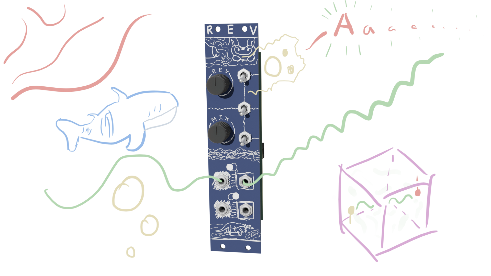
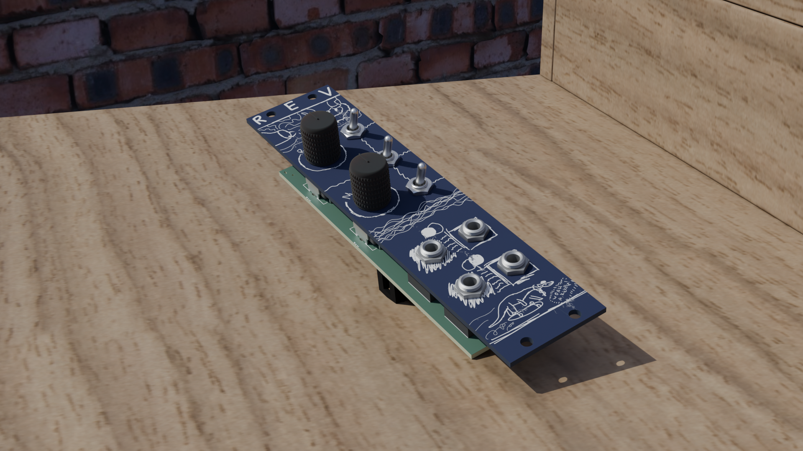
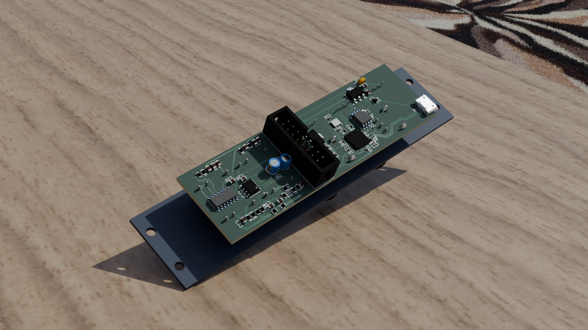
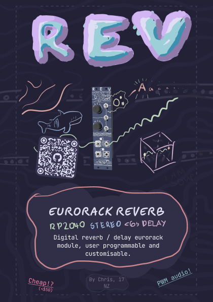

# REV

_Digital reverb / delay eurorack module, user programmable and customisable._

#### What?
The next effect in a series of eurorack modules! REV is a custom digital reverb/delay processer, utilising the rp2040 mcu. Includes firmware for a basic algorithmic reverb, completely configurable via software. Default configuration uses 60kb of sram out of 264kb max. 

In terms of controls, REV features two potentiometers and 3 switches, which are by default configured to control reverb length and mix, with the switches adjusting brightness, density and stereo mixing.

#### Why?
Reverb is a very widely used effect, and arguably one of the most important in synthesizers. It sounds pretty cool but is unfortunately quite tricky to do completely analog. This module aims to provide a convenient and open source base to not only use as a reverb module, but also to prototype other digital effects.

I personally decided to make it due to my frustration with constantly having to lug around my laptop whenever I wanted reverb on my synth (which doesn't have an in-built fx section). A eurorack module is much more convenient. Having it be my own hardware allows for much more customisation than off the shelf modules / pedals, which I find very attractive.

#### How to use?
REV is a stereo board, it has an input and output for left and right, and the controls are all labelled.

In terms of getting it set up, you'll need to program the rp2040. To do this, bridge J4, which will allow you to program the flash, and then plug in the usb port. The rp2040 should show up as USB Mass Storage Device. Copy the uf2 file from the releases tab folder into the device and then disconnect J4 and unplug the usb. When you power it up via the eurorack power connector (not usb) the module should be functional.

## Renders

## Schematics

## Zine Page

## BOM
_Needed is how many I personally need :)_
| Part                                 | Quantity | Needed | Source     | Link                                                                      | Lot / Min Amount | Unit    | Net     | Running |
|--------------------------------------|----------|--------|------------|---------------------------------------------------------------------------|------------------|---------|---------|---------|
| **Capacitors**                           |          |        |            |                                                                           |                  |         |         |         |
| 100n Cap, 0805                       | 19       | 19     | JLCPCB     | https://jlcpcb.com/partdetail/YAGEO-CC0805KRX7R9BB104/C49678              | 1                | $0.0094 | $0.1786 | $0.18   |
| 1u Cap, 0805                         | 2        | 2      | JLCPCB     | https://jlcpcb.com/partdetail/29074-CL21B105KBFNNNE/C28323                | 1                | $0.0190 | $0.0380 | $0.22   |
| 10u Cap, 0805                        | 4        | 4      | JLCPCB     | https://jlcpcb.com/partdetail/16532-CL21A106KAYNNNE/C15850                | 1                | $0.0472 | $0.1888 | $0.41   |
| 47u Cap, 0805                        | 2        | 2      | JLCPCB     | https://jlcpcb.com/partdetail/17464-CL21A476MQYNNNE/C16780                | 1                | $0.0921 | $0.1842 | $0.59   |
| 10u Electrolytic Cap, D4.0xP1.5      | 2        | 0      | LCSC       | https://www.lcsc.com/product-detail/C88726.html                           | 10               | $0.0564 | $0.5600 | $1.15   |
| 22u Tantalum Cap, CASE-A-3216-18(mm) | 2        | 2      | LCSC       | https://www.lcsc.com/product-detail/C11366.html                           | 1                | $0.2379 | $0.4758 | $1.63   |
| **Resistors**                            |          |        |            |                                                                           |                  |         |         |         |
| 22? Resistor, 0805                   | 2        | 2      | JLCPCB     | https://jlcpcb.com/partdetail/18249-0805W8F220JT5E/C17561                 | 1                | $0.0027 | $0.0054 | $1.63   |
| 100? Resistor, 0805                  | 2        | 2      | JLCPCB     | https://jlcpcb.com/partdetail/18096-0805W8F1000T5E/C17408                 | 1                | $0.0023 | $0.0046 | $1.64   |
| 220? Resistor, 0805                  | 2        | 2      | JLCPCB     | https://jlcpcb.com/partdetail/18245-0805W8F2200T5E/C17557                 | 1                | $0.0031 | $0.0062 | $1.64   |
| 3.9k? Resistor, 0805                 | 2        | 2      | JLCPCB     | https://jlcpcb.com/partdetail/18302-0805W8F3901T5E/C17614                 | 1                | $0.0031 | $0.0062 | $1.65   |
| 10k? Resistor, 0805                  | 5        | 5      | JLCPCB     | https://jlcpcb.com/partdetail/18102-0805W8F1002T5E/C17414                 | 1                | $0.0029 | $0.0145 | $1.66   |
| 1M? Resistor, 0805                   | 2        | 2      | JLCPCB     | https://jlcpcb.com/partdetail/18202-0805W8F1004T5E/C17514                 | 1                | $0.0024 | $0.0048 | $1.67   |
| **Other**                                |          |        |            |                                                                           |                  |         |         |         |
| Schottky Diode, SOD-323              | 2        | 2      | JLCPCB     | https://jlcpcb.com/partdetail/GuangdongHottech-1N5819WS/C191023           | 1                | $0.0111 | $0.0222 | $1.69   |
| PJ301M-12 Jacks                      | 4        | 0      | Aliexpress | www.aliexpress.com/item/1005004864182675.html                             | 10               | $4.4000 | $0.0000 | $1.69   |
| RK09K 100k Potentiometer             | 2        | 0      | Aliexpress | https://www.aliexpress.com/item/1005007278123055.html                     | 5                | $1.0400 | $0.0000 | $1.69   |
| TL072CDT                             | 1        | 1      | JLCPCB     | https://jlcpcb.com/partdetail/STMicroelectronics-TL072CDT/C6961           | 1                | $0.1568 | $0.1568 | $1.85   |
| X322512MSB4SI 12MHz Crystal          | 1        | 1      | JLCPCB     | https://jlcpcb.com/partdetail/YXC_CrystalOscillators-X322512MSB4SI/C9002  | 1                | $0.0740 | $0.0740 | $1.92   |
| 74HC04D Logic Inverter               | 1        | 1      | JLCPCB     | https://jlcpcb.com/partdetail/Nexperia-74HC04D653/C5590                   | 1                | $0.1521 | $0.1521 | $2.07   |
| W25Q128JVS Flash                     | 1        | 1      | JLCPCB     | https://jlcpcb.com/partdetail/WinbondElec-W25Q128JVSIQ/C97521             | 1                | $2.6146 | $2.6146 | $4.69   |
| AMS1117-3.3 LDO                      | 2        | 2      | JLCPCB     | https://jlcpcb.com/partdetail/Advanced_MonolithicSystems-AMS1117_33/C6186 | 1                | $0.2024 | $0.4048 | $5.09   |
| RP2040 MCU                           | 1        | 1      | JLCPCB     | https://jlcpcb.com/partdetail/RaspberryPi-RP2040/C2040                    | 1                | $0.9843 | $0.9843 | $6.08   |
| IDC Connector                        | 1        | 0      | LCSC       | https://www.lcsc.com/product-detail/C7430313.html                         | 5                | $0.0834 | $0.0000 | $6.08   |
| USB B Micro Port                     | 1        | 1      | JLCPCB     | https://jlcpcb.com/partdetail/SHOUHAN-MicroXNJ/C404969                    | 1                | $0.0406 | $0.0406 | $6.12   |
| SPDT Switch                          | 3        | 0      | Aliexpress | https://www.aliexpress.com/item/1005005370002265.html                     | 5                | $0.8520 | $0.0000 | $6.12   |
| **Non-Components**                       |          |        |            |                                                                           |                  |         |         |         |
| Aluminium Plate (100x200x2mm)        | 1        | 1      | Aliexpress | https://www.aliexpress.com/item/1005007160296738.html                     | 1                | $6.2300 | $6.2300 | $12.35  |
| PCB                                  | 1        | 1      | JLCPCB     | NA                                                                        | 5                | $0.8200 | $4.1000 | $16.45  |
| **Total**                                |          |        |            |                                                                           |                  |         |         | $16.45  |

| Totals                          | Money  |
|---------------------------------|--------|
| Aliexpress, Inc. Shipping + Tax | $7.35  |
| JLCPCB, Inc. Shipping + Tax     | $41.21 |
| **Total**                           | $48.56 |

## CAD Links
Heres the links to the CAD source, Onshape:
[Panel source](https://cad.onshape.com/documents/1214f87d69295045284472ae/w/920e2a43c1f3f44d8378acda/e/9f1143cafdcad0010397ac9a)

## Directory Structure
- **hardware/**
    - **bom/** - BOM Files (CSV and LibreOffice Calc)
    - **cad/** - CAD Files
        - **render/** - Files for rendering (inc. gltf models)
    - **rev/** - KiCad files
        - **lib/** - External libraries
        - **production/** - Production files (Gerber, etc.)
        - **plots/** - Schematic plot
- **journals/**
- **zine/** - Zine page

## References
[RP2040 Hardware Guide](https://pip-assets.raspberrypi.com/categories/814-rp2040/documents/RP-008279-DS-1-hardware-design-with-rp2040.pdf)

#### This project was created for [Hack Club](https://hackclub.com/) - [Fallout](https://fallout.hackclub.com/)